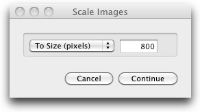

#Resize Image 1.0
by Pedro Parracho <pedro.parracho@gmail.com>

## Description:
Automator workflow to resize images in MacOs.   
 
## Install
To install you need to copy the workflow to the folder `~/Library/Services`.

## Feature
It takes a file `image.jpg` and it will produce a file `image_resized.jpg` with the maximum size as defined (default value: 800pixels).

##Screenshot

## License

 This work is licensed under a <a rel="license" href="http://creativecommons.org/licenses/by-nc/3.0/">Creative Commons Attribution-NonCommercial 3.0 Unported License</a>.